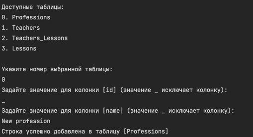

# Работа с БД

Приложение умеет:

* Получать список таблиц в БД
* Получать данные этих таблиц
* Вставлять новые строки в выбранную таблицу
* Отображать всё в удобном формате

## Главное меню

## Список всех таблиц

## Таблицы и данные

## Вставка новой строки в таблицу

